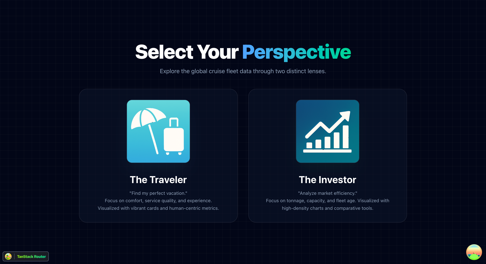
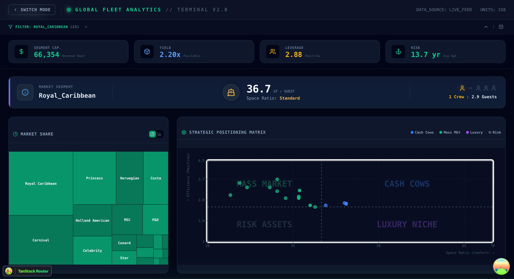
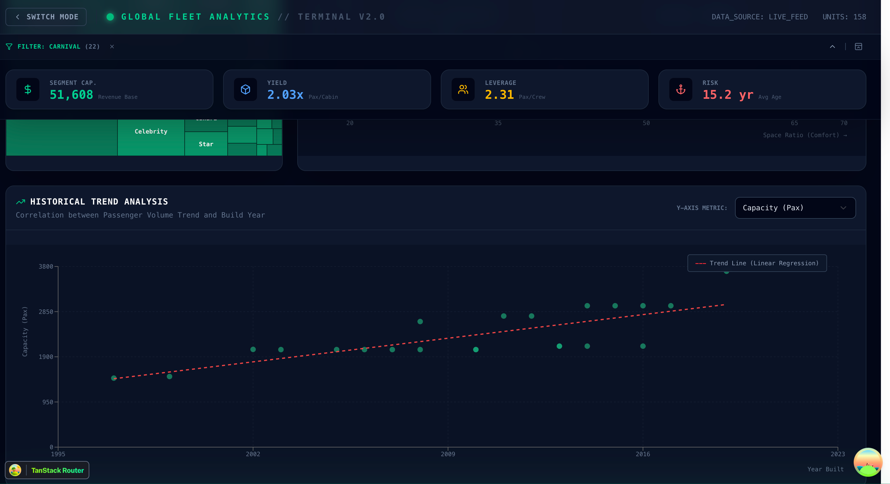
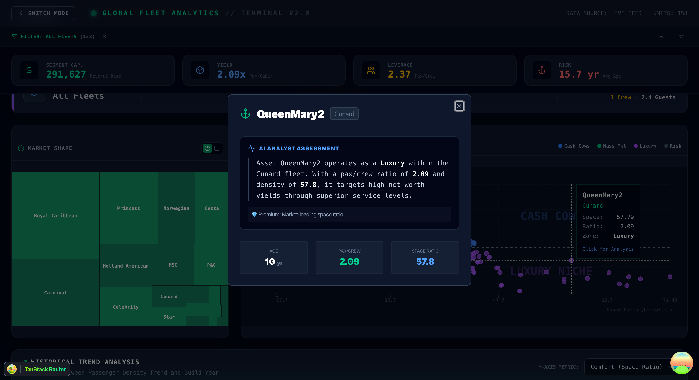
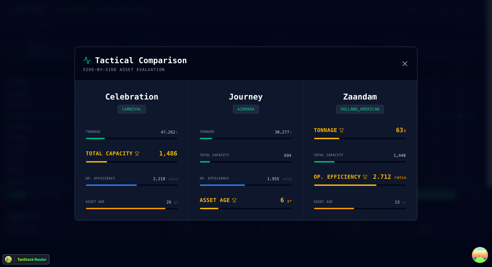
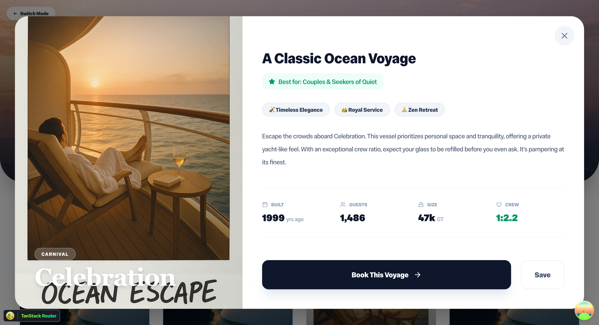
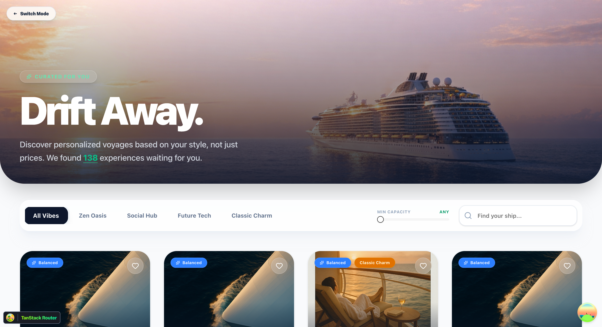
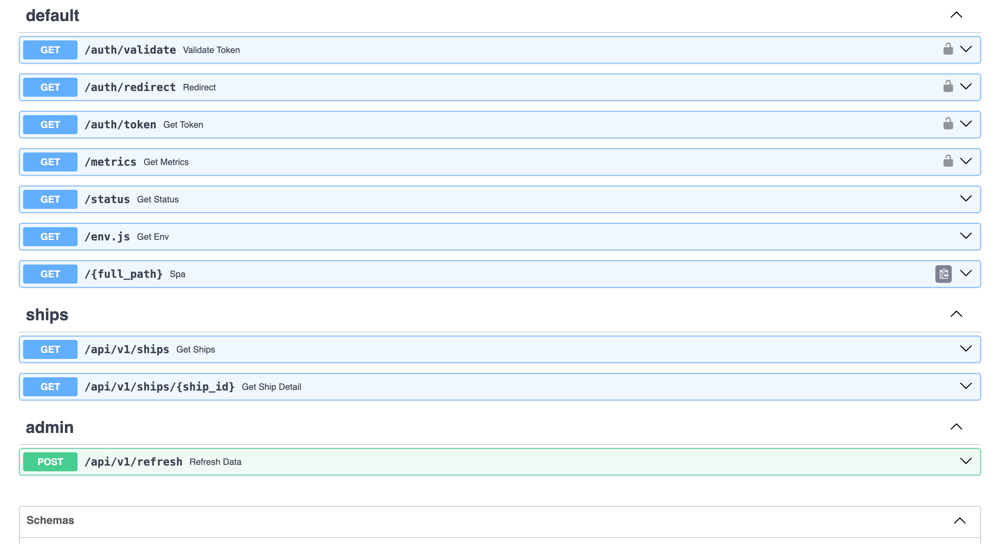

# Data for Humanities Internship Application Task

Applicant: Hongyi Luo, MSc. Environmental Data Science and Machine Learning 

> **Submission for DSI / OVE Data Visualisation Internship Application**
>
> A full-stack data visualisation application featuring a **Dual-Persona Architecture**. Applying design thinking, I transformed a single dataset of raw cruise ship records (CSV) into two distinct interactive experiences tailored to conflicting user needs.

## Frontend

Raw data metrics (e.g., "Gross Tonnage", "Passenger Density") are inherently emotionless. For this project, rather than building a generic "one-size-fits-all" dashboard, I designed two separate views to demonstrate **Data Storytelling**: providing **decision-making efficiency for investors** and **emotional resonance for travelers**.

### B2B: Investor Terminal

#### 1. View Introduction
- **Design Language:** Adopts a **Dark Mode** aesthetic similar to a Bloomberg Terminal, emphasizing professionalism and visual comfort for prolonged data analysis.
- **Layout Strategy:** High information density. A sticky top KPI dashboard provides immediate visibility of key metrics (e.g., Total Capacity, Average Fleet Age), while the main area supports deep-diving via multi-dimensional charts.

#### 2. Technical Highlights
- **Strategic Positioning Matrix:** Investors need to instantly segment a fleet. A list of numbers doesn't show positioning. I used a **Recharts Scatter Plot**. By mapping "Space Ratio (Comfort)" on the X-axis and "Operational Efficiency" on the Y-axis, fleets are automatically segmented into four strategic quadrants (e.g., "Cash Cows", "Luxury Niche").

- **Historical Trend Analysis (Time-Series):** I designed this view because **Time** is the critical dimension for understanding asset depreciation and design evolution. Static tables hide the industry's shift toward "Mega-Ships." I implemented a **client-side Linear Regression algorithm (Least Squares)**. This allows analysts to dynamically correlate any two metrics (e.g., Year Built vs. Service Ratio) to mathematically visualize the industry's trajectory, moving beyond simple observation to statistical proof.

- **Interactive Cross-Filtering:** Achieved deep linkage between charts and the data list. Clicking on a specific company in the Treemap or an age group in the Bar Chart automatically filters the global dataset in real-time.

- **Comparison Tray:** Developed a sticky bottom tray that allows users to select multiple vessels from the list and launch a "head-to-head" parameter comparison in a modal view.

#### 3. Data Insights
- **Operational Efficiency Identification:** Through matrix analysis, investors can instantly identify which vessels are **Cash Cows** (high density, high yield) and which are **Risk Assets** (high operational costs, aging hardware).
- **Market Share Analysis:** A Treemap visualization clearly displays the capacity monopoly held by major cruise lines.

- **The "Service Floor" Phenomenon (Technological vs. Human Scaling):**
  - **Observation:** The time-series analysis reveals a diverging trend. While Gross Tonnage has skyrocketed linearly over the last 20 years (ships are getting significantly bigger), the Passenger/Crew Ratio has risen only marginally.
  - **Analysis:** This counter-intuitive finding suggests that Economies of Scale in the cruise industry are derived from infrastructure reuse (hulls, engines, navigation systems), not from slashing service labor. Automation handles the ship's operation, but cruise lines maintain a strict "Service Floor" (human hospitality) to preserve the guest experience, even on massive vessels.
- **The "Oasis" Anomaly (Efficiency Breakout):**
  - **Observation:** Royal Caribbean's Oasis class (220k tons) maintains a density score (40.7) superior to many smaller, older ships (e.g., Carnival Holiday at 31.7).
  - **Analysis:** This proves that **"Bigger $\neq$ More Crowded."** RCI has successfully decoupled capacity from density, creating a high-margin product that offers superior space and scale simultaneously—a key indicator of a "Cash Cow" asset.

### B2C: Traveler Experience

#### 1. View Introduction
- **Design Language:** Adopts a modern **Light Mode** style typical of OTA (Online Travel Agency) and social media (Instagram / RedNote) platforms. Utilizes large rounded cards, magazine-style typography, and immersive Hero Images to evoke a relaxed holiday atmosphere.
- **Interaction Strategy:** Reduces cognitive load by hiding dry technical specifications and translating them into user-perceivable "Experience Tags."

#### 2. Technical Highlights
- **Data Storytelling:**
    - **Vibe Meter:** Engineered an algorithm to translate cold `Passenger Density` data into relatable vibe tags like **"Social Hub"** or **"Zen Oasis"**.
    - **AI Analyst:** Automatically generates marketing copy based on ship attributes (e.g., *"An Exclusive Sanctuary at Sea"*), simulating personalized recommendations.

- **Visual Engineering:**

    - **AIGC Asset Integration:** Integrated a **Generative AI workflow** to create bespoke UI assets. This includes the Landing Page "Mode-Switcher" Icons and the immersive Hero Backgrounds, establishing a unique brand identity without relying on generic stock photography.

    - **Deterministic Asset Hashing:** Wrote a custom algorithm to map ship names to a pre-generated library of AI assets. This ensures every ship has a consistent visual representation across sessions, with graceful fallbacks for missing images.
    - **Shadcn UI Customization:** Deeply customized Slider, Dialog, and Input components to ensure the UI style aligns perfectly with the vacation theme.

#### 3. Consumer-Centric Data Strategy

Instead of showing raw analytics, I used data to solve specific traveler pain points, turning "Insights" into "Decision Support."

* **Democratizing "Hidden" Metrics (The Space Ratio):**
    * **The User Pain Point:** Travelers often assume "Big Ship = Crowded" or "Expensive = Better," but lack objective benchmarks.
    * **My Analysis:** I identified that **Passenger Density** is the single best proxy for physical comfort, yet it's rarely shown on OTAs.
    * **The Design Value:** By visualizing this metric (e.g., *Disney Magic* scores 47 vs. industry avg 35), I empower users to identify **"Hidden Value"**—ships that offer luxury-level space at mass-market prices—without needing to do the math themselves.

* **Algorithmic Personality Matching (The Vibe Meter):**
    * **The User Pain Point:** It is difficult to predict the onboard atmosphere (e.g., "Is this ship too quiet for my kids?" or "Is it too loud for my honeymoon?") from technical specs.
    * **My Analysis:** I found a strong correlation between **Ship Age** and **Density** trends. High density + New Ship usually equals "High-Tech/Active," while Low Density + Old Ship equals "Classic/Quiet."
    * **The Design Value:** I encoded this correlation into a **"Vibe" tagging system**. This prevents "Experience Mismatch" by automatically guiding a party-seeker away from a quiet retirement vessel, transforming raw rows into meaningful recommendations.

* **Service Transparency (The Crew Ratio):**
    * **The User Pain Point:** "Luxury" is often just a marketing buzzword.
    * **My Analysis:** The **Passenger-to-Crew Ratio** is the only non-manipulatable indicator of service attention.
    * **The Design Value:** I surfaced this usually hidden operational metric. Users can instantly distinguish between **"Standard Hospitality" (1:3)** and **"Royal Treatment" (1:1.5)**, allowing them to manage their service expectations before booking.

### Future Frontend Improvements
- **Performance Optimization:** Implement `react-window` for virtual scrolling to handle massive datasets more efficiently.
- **Geospatial Integration:** Integrate Mapbox/Leaflet to visualize ship itineraries and real-time locations, adding a geographical dimension to the analysis.

## Backend

> **Design Decision: The "Monolithic Main" Approach**
> For this specific internship demo, I intentionally adopted a simplified, high-efficiency architecture. Instead of over-engineering with multiple layers of abstraction (Services/Controllers/Repositories), I consolidated the core logic into `app/main.py`. This decision maximized iteration speed and code readability for a single-developer scope.

### Technical Details
* **FastAPI (Python):** Serves as the high-performance backbone. I leveraged Pydantic models (`class Ship(BaseModel)`) to strictly define the data schema, ensuring type safety and automatic API documentation generation.
* **In-Memory Database (`ShipDatabase`):**
    * Designed a custom Python class that acts as a resident memory database.
    * **Robust CSV Ingestion:** On startup, the system parses `cruise_ship_info.csv` using Python's native `csv` library. I implemented specific error handling (`try-except` blocks) to gracefully skip malformed rows without crashing the application.
    * **Zero-Latency Reads:** Since data resides in RAM, API response times are sub-millisecond, providing an instant user experience for the frontend.
* **Direct Routing Strategy:**
    * Bypassed the traditional `APIRouter` nesting.
    * Endpoints like `GET /api/v1/ships` are mounted directly to the `app` instance.
    * Implemented flexible query parameters (e.g., `?cruise_line=Carnival&min_passengers=2000`) to support the frontend's complex filtering logic on the server side.
* **Key Endpoints:**
    - `GET /api/v1/ships`: Returns the full or filtered list of vessels.
    - `GET /api/v1/ships/{id}`: Returns detailed data for a specific asset.
    - `POST /api/v1/refresh`: A "Admin-like" endpoint to hot-reload data from the CSV without restarting the server.

### Future Backend Improvements

- **Role-Based Access Control (RBAC):**    
  - **Current State:** The API endpoints are currently open for demonstration purposes.    
  - **Plan:** Implement a permission layer (e.g., using `FastAPI-Users` or custom middleware) to distinguish between **'Viewer'** (read-only access to charts) and **'Admin'** (access to operational endpoints like `POST /refresh`). This ensures data integrity and security in a multi-user environment.

* **Scalability Refactoring:** For a production environment, I would decouple the logic back into `routers/`, `services/`, and `models/` directories following standard FastAPI project structures.
* **Persistence Layer:** Migrate from the in-memory `ShipDatabase` to a relational database (e.g., **PostgreSQL**) using **SQLAlchemy** or **Tortoise ORM** to handle transactional data and complex relationships.
* **Unit Testing:** Implement `pytest` to cover edge cases in data parsing and API validation.